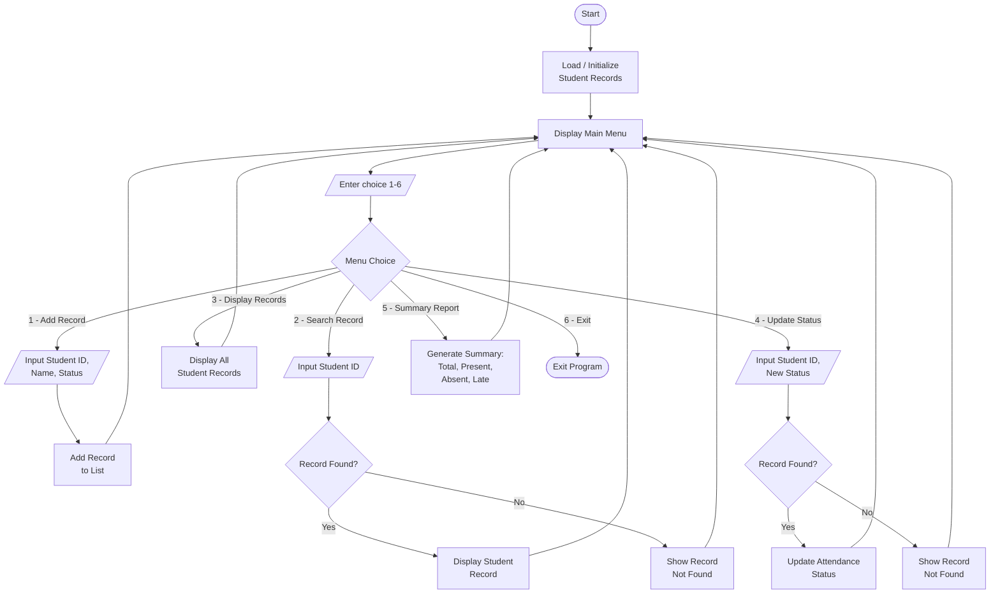

# Student Attendance System – System Flowchart

This flowchart shows the overall flow of the console-based Student Attendance
System, from program start through the main menu options to exit.

> **Note:** GitHub renders the Mermaid diagram below automatically. A rendered
> image version (`attendance_flowchart.png`) is also included in this folder for
> pasting into the PDF submission. A plain-text version
> (`attendance_flowchart_ascii.txt`) is provided as a backup.

## Flowchart (Mermaid)

## How to read the flowchart

| Symbol | Meaning |
|--------|---------|
| Rounded rectangle (Start / Exit) | Terminator – beginning or end of the program |
| Parallelogram (`/ ... /`) | Input / Output – data entered by the user or shown on screen |
| Rectangle | Process – an action the program performs |
| Diamond | Decision – the program chooses a path based on a condition |

## Flow description

1. **Start** – The program begins.
2. **Load / Initialize Student Records** – The list that holds up to 25 student
   records is prepared.
3. **Display Main Menu** – The six options are shown to the user.
4. **Enter choice (1–6)** – The user types a menu option.
5. **Menu Choice (decision)** – The program branches based on the choice:
   - **1 – Add Record:** Enter Student ID, Name, and Attendance Status, then add
     the record to the list and return to the menu.
   - **2 – Search Record:** Enter a Student ID. If the record is found, display
     it; if not, show "Record Not Found." Return to the menu.
   - **3 – Display Records:** Show all student records, then return to the menu.
   - **4 – Update Status:** Enter a Student ID and a new status. If found, update
     the attendance status; if not, show "Record Not Found." Return to the menu.
   - **5 – Summary Report:** Generate and display the summary (Total Students,
     Present, Absent, Late), then return to the menu.
   - **6 – Exit:** End the program.
6. The menu repeats until the user selects **Exit**.
