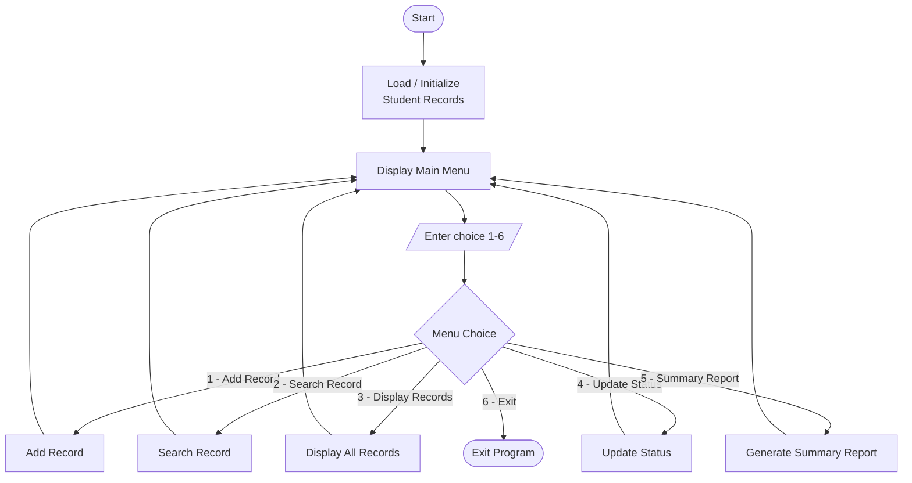

# Student Attendance System

**Team 1** — Introduction to Programming, Assignment 2

A console-based Python application that allows a school to track student
attendance for a class. It manages at least 25 student records and generates an
attendance summary report. *(No source code yet — this assignment covers planning,
design, and GitHub setup only.)*

🔗 **Repository:** https://github.com/samborambo-cpu/Team1-StudentAttendanceSystem

## Team Members
- **Samuel Azize** — Project Manager / GitHub Coordinator
- **Camilo Sequeira** — Documentation Manager
- **Luis Monsalve** — Software Developer

## Project Description
The Student Attendance System tracks attendance for a class of at least 25
students. Each record stores a **Student ID**, **Student Name**, and
**Attendance Status** (Present, Absent, or Late). Through a simple text menu, the
user can add records, search for a student, display all records, update a
student's status, and generate a summary report.

## Problem Statement
Taking attendance on paper is slow, easy to lose, and prone to human error.
Teachers need a fast, consistent way to record each student's status and instantly
see class totals. This system stores attendance digitally and generates an
accurate summary report on demand.

## Project Goals
- Add attendance records (ID, Name, Status)
- Search for a student record by ID
- Display all attendance records
- Update a student's attendance status
- Generate a summary report (Total, Present, Absent, Late)
- Provide a clear, menu-driven interface

## Assigned Roles
| Member | Role | Responsibilities |
|--------|------|------------------|
| Samuel Azize | Project Manager / GitHub Coordinator | Coordinates the team, tracks progress, manages the repository and collaborators |
| Camilo Sequeira | Documentation Manager | Maintains documentation and organizes project files |
| Luis Monsalve | Software Developer | Owns the design and future implementation |

## System Flowchart
The full flowchart is in [`Flowcharts/attendance_flowchart.md`](Flowcharts/attendance_flowchart.md)
(rendered below) with an image version at `Flowcharts/attendance_flowchart.png`.

## Repository Structure
| Folder | Contents |
|--------|----------|
| `Documentation/` | Project plan, program structure, team responsibilities, submission draft |
| `Flowcharts/` | System flowchart (Mermaid, PNG, and text versions) |
| `SourceCode/` | Reserved for future Python source code |
| `Screenshots/` | GitHub screenshots for the submission |
